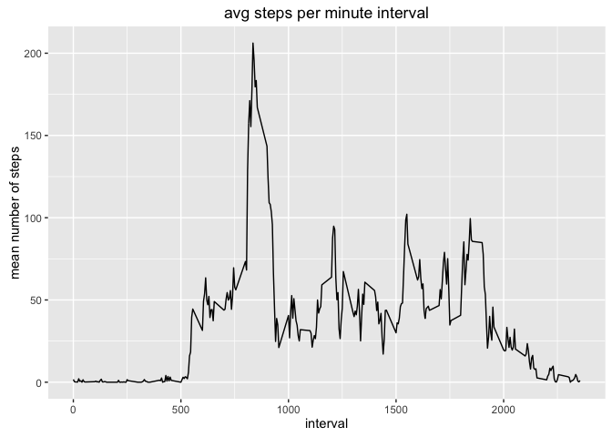
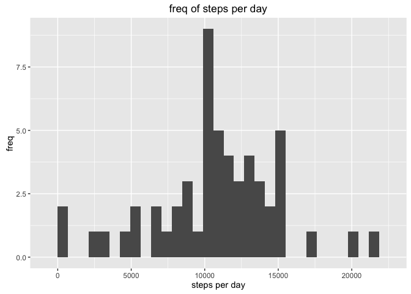
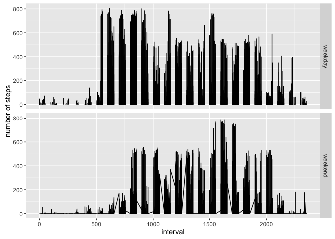

# Reproducible Research: Peer Assessment 1


```r
library(ggplot2)
options(scipen=999, digits=2)
```

## Loading and preprocessing the data

```r
# unzip and load csv
all_data <- read.csv(file=unzip("activity.zip"), header=TRUE, sep=",")

# convert dates to actual dates
all_data$date <- as.Date(all_data$date)

# clean data
clean_data <- all_data[!is.na(all_data$steps), ]
```


```r
head(all_data)
```

```
##   steps       date interval
## 1    NA 2012-10-01        0
## 2    NA 2012-10-01        5
## 3    NA 2012-10-01       10
## 4    NA 2012-10-01       15
## 5    NA 2012-10-01       20
## 6    NA 2012-10-01       25
```

```r
head(clean_data)
```

```
##     steps       date interval
## 289     0 2012-10-02        0
## 290     0 2012-10-02        5
## 291     0 2012-10-02       10
## 292     0 2012-10-02       15
## 293     0 2012-10-02       20
## 294     0 2012-10-02       25
```

## What is mean total number of steps taken per day?

```r
daily <- aggregate(formula = steps ~ date, data=clean_data, FUN=sum, na.rm=TRUE)

mean_steps <- round(mean(daily$steps), 2)
median_steps <- quantile(x = daily$steps, probs = 0.5)

ggplot(daily, aes(daily$steps)) + geom_histogram() + ggtitle("freq of steps per day") +
  xlab("steps per day") + ylab("freq")
```

```
## `stat_bin()` using `bins = 30`. Pick better value with `binwidth`.
```


- Mean is 10766.19
- Median is 10765

## What is the average daily activity pattern?

```r
by_interval <- aggregate(formula = steps ~ interval, data=clean_data, FUN=mean, na.rm=TRUE)

ggplot(by_interval, aes(x=by_interval$interval, y=by_interval$steps)) + geom_line() + ggtitle("avg steps per minute interval") + xlab("interval") + ylab("mean number of steps")
```



```r
max_avg_activity <- by_interval[which.max(by_interval$steps),]
```

- maximum avg activity interval: 835
- maximum avg activity steps: 206.17

## Imputing missing values

```r
total_NA <- sum(!complete.cases(all_data))

# copy original data
imputed_data <- all_data
```


```r
avg_per_interval <- aggregate(steps ~ interval, all_data, mean)
avg_per_interval[which.max(avg_per_interval$steps),]
```

```
##     interval steps
## 104      835   206
```

```r
imputed_data$steps[is.na(imputed_data$steps)] <- avg_per_interval[avg_per_interval$interval == imputed_data$interval[is.na(imputed_data$steps)], 'steps']
```


```r
daily_imputed <- aggregate(formula = steps ~ date, data=imputed_data, FUN=sum, na.rm=TRUE)

mean_steps <- round(mean(daily_imputed$steps), 2)
median_steps <- quantile(x = daily_imputed$steps, probs = 0.5)

ggplot(daily_imputed, aes(daily_imputed$steps)) + geom_histogram() + ggtitle("freq of steps per day") +
  xlab("steps per day") + ylab("freq")
```

```
## `stat_bin()` using `bins = 30`. Pick better value with `binwidth`.
```



- total_NA: 2304

## Are there differences in activity patterns between weekdays and weekends?

```r
library(chron)
imputed_data$day_type <- factor(is.weekend(imputed_data$date), labels = c('weekday', 'weekend'))
```


```r
avg_day_complete <- aggregate (steps ~ interval + day_type, imputed_data, mean)
qplot(interval, steps, data = imputed_data, geom = 'line', facets = day_type ~ ., xlab = 'interval', ylab = 'number of steps')
```



